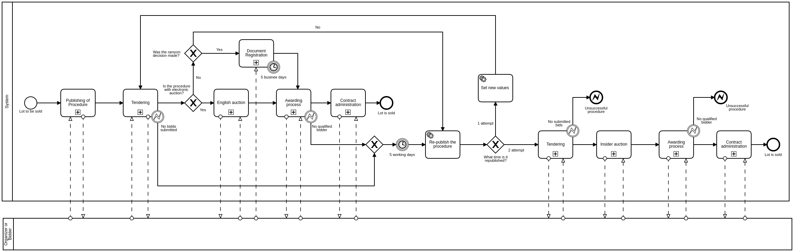

.. _procedure_workflow:

##################
Procedure Workflow
##################

The Overall Small-Scale Privatization Process
=============================================

Status Workflow
===============

.. graphviz::

    digraph G {
        node [style=filled, fillcolor=seashell2];
        edge[style=dashed,  arrowhead="vee"];
        "pending.activation" -> "active.tendering" [color="0.7777 1.0000 0.5020"];
        edge[style=solid,  arrowhead="vee"];
        "active.tendering" -> "active.qualification" [color="0.7777 1.0000 0.5020"];
        edge[dir="forward"];
        "active.qualification" -> "active.awarded" [color="0.7777 1.0000 0.5020"];

        subgraph cluster_1 {
            node [style=solid];
            edge[style=solid]
            "active.tendering" -> "unsuccessful" [color="0.0000 0.0000 0.3882"];
            edge[style=solid]
            "active.qualification" -> "unsuccessful" [color="0.0000 0.0000 0.3882"];
            edge[style=solid];
            "active.awarded" -> "unsuccessful" [color="0.0000 0.0000 0.3882"];
            color=white;
        }

        subgraph cluster_2 {
         node [style=solid];
            edge[style=dashed]
            "active.tendering" -> "cancelled" [color="0.0000 0.0000 0.3882"];
            edge[style=dashed]
            "active.qualification" -> "cancelled" [color="0.0000 0.0000 0.3882"];
            edge[style=dashed];
            "active.awarded" -> "cancelled" [color="0.0000 0.0000 0.3882"];
            color=white;
        }

        edge[dir="forward"];
        "active.awarded" -> "complete" [color="0.7777 1.0000 0.5020"];       
    }

Roles
"""""

:Chronograph: solid

:Organizer:  dashed
